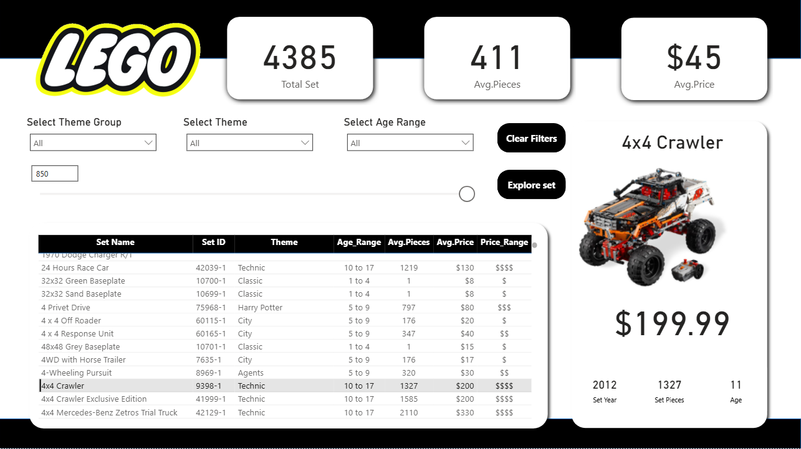

# LEGO Power BI Dashboard

## Project Overview

This project is an interactive Power BI dashboard that analyzes LEGO sets across themes, age ranges, price ranges, and piece counts. It was designed to showcase data transformation, DAX calculations, and visualization skills while providing meaningful business insights.

## Goals

* Build a dashboard that enables users to explore LEGO sets by **theme, age, price, and number of pieces**.
* Provide decision making support by identifying **trends, pricing strategies, and customer targeting opportunities**.
* Demonstrate Power BI features such as **conditional columns, slicers, tooltips, decomposition trees, and navigation buttons**.

## Features

* **Conditional Columns**: Classified LEGO sets into Age Ranges and Price Ranges.
* **Interactive Slicers & Parameters**: Filter sets by exact or minimum price.
* **Tooltips with Images**: Display LEGO set images on hover.
* **Details Panel**: Show selected set details (name, year, price, pieces, image).
* **Decomposition Tree**: Drill down Total Sets by Category → Theme Group → Theme → Set Name.
* **Navigation Buttons**: Move between pages with one click.

## How to Use

1. Clone the repository.
2. Open the `.pbix` file in Power BI Desktop.
3. Explore the dashboard by interacting with slicers, buttons, and tooltips.

## Dashboard Preview

  

## Tools & Technologies

* **Power BI** (Data modeling, DAX, Visualization)
* **Power Query** (Data transformation)
* **DAX** (Measures & calculations)
